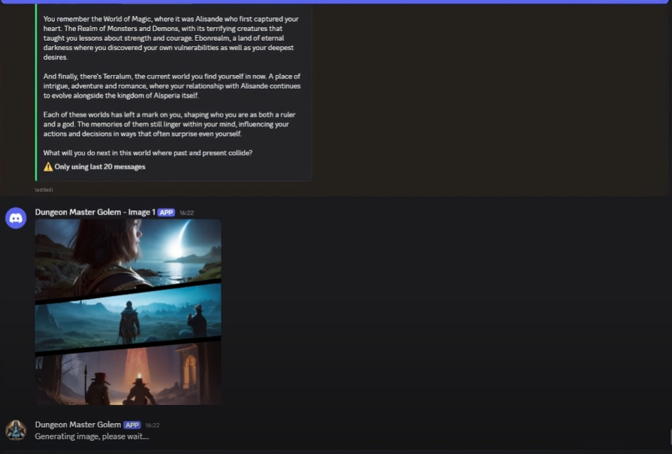

<h1 align="center">
  Golem Dungeon Master
</h1>





<h3 align="center"><i>
  Talk to LLMs with your friends — or let a Dungeon Master guide your adventures!
  based from https://github.com/jakobdylanc/discord-llm-chatbot 
</i></h3>

<p align="center">
  <iframe width="560" height="315" src="https://youtu.be/eh1zlL_8NwI?si=3JswF5b6vkO2QMW4" frameborder="0" allowfullscreen></iframe>
</p>

---

## Dependencies

- ### ollama
  - download ollama - https://ollama.com/download
  - pull llava:13b-v1.6

- ### stable-diffusion-webui api
  - use https://github.com/AUTOMATIC1111/stable-diffusion-webui
  - use api mode

- ### .Net 

- ### Docker Desktop

- ### microsoft kernel-memory
```
docker run -it --rm --name dm -v <your directory>:/qdrant/storage -p 6333:6333 qdrant/qdrant:v1.7.0
``` 

- ### microsoft kernel-memory-plugin
  - https://github.com/goyanx/kernel-memory-plugin

## 🚀 Features

- ### 🗨️ Dynamic Chat System
  - Mention the bot (`@Dungeon Master`) to start a conversation or reply to continue a thread.
  - Supports branching conversations and nested replies.
  - Conversations can be moved to threads — continuity is preserved!

- ### 🤖 Dungeon Master Mode (Custom Narrative AI)
  - Acts as a Dungeon Master in your custom fantasy world.
  - Remembers characters, places, events, and narrative beats.
  - Supports lewd, mature, and violent content **within story context**.
  - Designed for storytelling, roleplay, and long-form memory-based interactions.

- ### 🧠 Memory Integration via function calling
  - Uses  `/upsert` to store data like names, dates, and actions.
  - Uses `/searchmemory` to recall data

- ### 🖼️ Image Generation
  - Automatically generates an image matching the bot’s reply using context and keyword mapping.
  - Uses custom LORAs and prompt templates for storytelling realism and style.

- ### 🧏 Voice Integration
  - Generates AI voice responses using ElevenLabs or a local TTS server.
  - Narration and character dialogue read out in-character.

- ### 👁️ Vision Model Support
  - Supports uploading images for interpretation (e.g., using `llava:13b` via Ollama).
  - Describes scenes, characters, or  content with explicit awareness.


---

## 🛠️ Setup Instructions

1. **Install dependencies**:
```
pip install -r requirements.txt
```

2. Configure environment:
```
Copy .env.example to .env
```

3. Fill in your API keys and preferences:

DISCORD_BOT_TOKEN, OPENAI_API_KEY (Use NVIDIA API KEY), MISTRAL_API_KEY

LLM, LOCAL_SERVER_URL, DISCORD_BOT_WEBHOOK

Invite the bot:

Replace <CLIENT_ID> with your Discord app's client ID:


4. Invite the bot to your Discord server:

Replace `<CLIENT_ID>` with your Discord app's client ID in the following URL:

```plaintext
https://discord.com/api/oauth2/authorize?client_id=<CLIENT_ID>&permissions=412317273088&scope=bot
```

5. Run the bot:

```bash
python llmcord.py
```


Mention the bot or reply to its message to continue a chain.

🔮 Roadmap / TODO

Multi-character AI interactions


